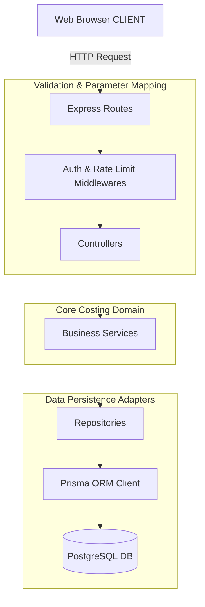

# JSW MCMS Architectural Specification

This document details the core architectural patterns, data flow designs, costing calculations, database strategies, and performance safeguards engineered into the **JSW Metal Cost Management System (MCMS)**.

---

## 🏛️ Clean Architecture Design System

The MCMS backend utilizes an adapted **Clean Architecture** pattern to divide concerns. Dependencies flow strictly in one direction: **from the outside (endpoints, database adapters) inward (business validation, costing rules)**.



### 1. Layers and Responsibilities

- **Routes (`src/routes`)**: Binds URIs to controller functions. Implements token clearance middleware and authorization layers.
- **Controllers (`src/controllers`)**: Standardizes input mapping, parses params, delegates to services, and hands execution back to utility response wrappers.
- **Services (`src/services`)**: Contains the core business rules. This is the authoritative domain layer for evaluations, calculations, and cost summaries.
- **Repositories (`src/repositories`)**: Isolates the database ORM query commands, ensuring that if you switch from Prisma, the rest of the application remains unchanged.
- **Prisma Client (`src/prisma`)**: The database query mapper and transactional state boundary.

---

## 🧮 Cost Calculation Mathematical Formulas

To ensure mathematical auditing and eliminate discrepancies, cost calculations are centralized inside `CalculationService.ts` and use **`Decimal.js`** to prevent JavaScript's native binary floating-point errors (e.g., `0.1 + 0.2 === 0.30000000000000004`).

### 1. Math Formulation

For every active line item in the calculation workspace, the base cost is evaluated using:

$$\text{ItemBaseCost} = (\text{Quantity} \times \text{LockedUnitPrice} \times \text{GradeMultiplier}) + \text{GradeExtraFee}$$

Where:
- **`Quantity`**: The mass or count of the metal (stored in kilograms, tons, or units).
- **`LockedUnitPrice`**: The master-locked unit cost sourced from the active `PriceList` for the specified metal/raw material.
- **`GradeMultiplier`**: The coefficient defined on the grade profile (e.g., `1.0500` for premium high-strength alloys).
- **`GradeExtraFee`**: The direct surcharge added for specific custom grades (e.g., galvanization, high-tolerance polishing).

The total costing metrics are then compiled across all items:

$$\text{CalculatedBaseCost} = \sum_{i=1}^{n} \text{ItemBaseCost}_i$$

$$\text{GstAmount} = \text{CalculatedBaseCost} \times \text{GstSlabRate}$$

$$\text{FinalCost} = \text{CalculatedBaseCost} + \text{GstAmount}$$

Where **`GstSlabRate`** is the active tax percentage parsed from the selected `GstSlab` (e.g., `0.1800` for $18\%$ GST).

---

## 📸 Transaction Snapshot Pattern

One of the most critical requirements for an industrial cost auditing tool is **historical immutable costing**. If an admin updates a metal's master unit price tomorrow, all calculations completed in the past must remain exactly the same.

```mermaid
sequenceDiagram
    autonumber
    actor Admin
    actor Production as Production User
    database DB as PostgreSQL DB
    
    Admin->>DB: Updates Master Price (Steel Code: ST01 = 50 INR/kg)
    Production->>DB: Pulls active price (ST01 = 50 INR/kg)
    Production->>Production: Compiles Calculation Workspace
    Production->>DB: Completes Calculation (Saves Snapshot)
    Note over DB: Database stores ST01=50 INR/kg unitPrice <br> & computed totals directly into JSON snapshot field.
    
    Admin->>DB: Updates Master Price (Steel Code: ST01 = 55 INR/kg)
    Production->>DB: Views Completed Calculation Receipt
    DB-->>Production: Returns Saved JSON Snapshot (Price = 50 INR/kg)
    Note over Production: Document displays historical cost (50 INR/kg),<br> fully immune to future price list updates.
```

### 1. Database Implementation

To achieve this, the Prisma schema implements a JSON **snapshot** column:
- **`Calculation.snapshot`**: Captures a frozen state of the overall calculation properties (selected GST rate, user, total costs).
- **`CalculationItem.snapshot`**: Captures a detailed map of the selected grade, active supplier price list ID, base costs, unit price, and multiplier utilized at that precise millisecond.
- In-flight operations (DRAFT status) fetch fresh prices. Completed calculations (COMPLETED status) bypass live queries and load directly from their respective snapshots.

---

## 📈 Performance & Scale Safeguards

1. **Custom Database Indexes**:
   - `@@index([metalId, active, effectiveFrom])` inside `PriceList` ensures that querying active historical prices takes sub-millisecond lookups.
   - `@@index([userId, readAt, createdAt])` inside `Notification` optimizes inbox counts.
2. **Reverse Proxy Gzip Compression**:
   - The production VPS distribution includes Nginx gzip limits (level 6 compression) for static React SPA assets, saving $70\%$ bandwidth.
3. **Database Connection Limits**:
   - Suffixing `connection_limit=10` on the serverless Neon string safeguards the database from hitting transaction pool depletion during rapid concurrent edge client refreshes.
