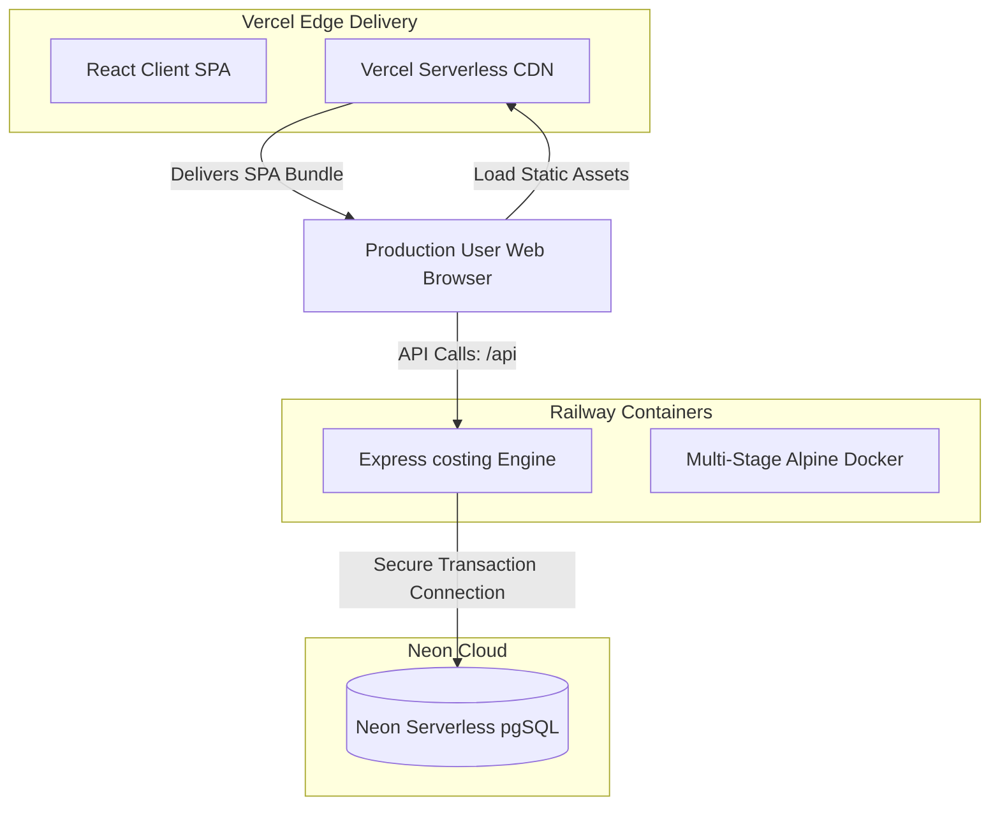

# JSW MCMS Deployment & Hosting Specification

This specification documents the complete production hosting blueprint, containerization pipelines, database setup, and web server proxies configured for the **JSW Metal Cost Management System (MCMS)**.

---

## 🌐 Production Cloud Topology

The system uses a modern, high-performance hosting topology:

- **Frontend Client (React SPA)**: **Vercel Serverless CDN** (Edge Delivery).
- **Backend Costing Engine (Express API)**: **Railway Container Runner** (Microservices Platform).
- **Transactional Storage**: **Neon Serverless PostgreSQL** (Cloud Database).



---

## 💻 Frontend Deployment: Vercel CDN Hardening

The client SPA is deployed directly to Vercel's global serverless edge network.

- **Config Location**: `apps/frontend/vercel.json`
- **Region Targeting**: Locked to `bom1` (Mumbai, India) to locate files closest to JSW's local operational centers, minimizing request round-trip latency.
- **Routing Rules**: Implements clean SPA URL routing. All requests (except assets or custom routes) rewrite to `/index.html` to allow React Router to manage state seamlessly.
- **Asset Optimization & Caching**: Custom HTTP headers set static JavaScript and CSS assets inside `/assets/*` as immutable:
  `Cache-Control: public, max-age=31536000, immutable`
- **Security Hardening Headers**:
  - `X-Frame-Options: SAMEORIGIN` (Blocks Clickjacking attacks).
  - `X-Content-Type-Options: nosniff` (Prevents browsers from executing mime-sniffed assets).
  - `Strict-Transport-Security: max-age=63072000; includeSubDomains` (Enforces HTTPS).
  - `Permissions-Policy`: Hard-disables device permissions (microphone, camera, geotagging).

---

## ⚙️ Backend Deployment: Railway Multi-Stage Containers

The backend compiles into a secure, minimal Docker container running Node.js `v22.x` on **Alpine Linux** to reduce visual attack vectors and size footprint.

- **Config Location**: `apps/backend/Dockerfile`
- **Platform Orchestration**: `apps/backend/railway.toml`

### 1. Multi-Stage Compiling Workflow

The backend uses a multi-stage Docker build to optimize build size:

```text
┌──────────────────────────────────────┐
│ Stage 1: Dependency Caching (deps)   │ <─ Downloads package.json mappings
└──────────────────┬───────────────────┘
                   ▼
┌──────────────────────────────────────┐
│ Stage 2: Compilation (builder)       │ <─ Compiles TypeScript to ES6 Modules
└──────────────────┬───────────────────┘
                   ▼
┌──────────────────────────────────────┐
│ Stage 3: Minimal Run-Environment     │ <─ Installs production dependencies only,
└──────────────────────────────────────┘    running as a restricted non-root OS user
```

1. **`deps` Stage**: Caches global root configurations and locks workspace dependency pools.
2. **`builder` Stage**: Compiles TypeScript files (`tsc`) to ES6 JavaScript modules and compiles the authoritative Prisma database client mapping types.
3. **`production` Stage**: Initializes the final image from `node:22-alpine`. It strips TypeScript compilation utilities, installs only core production dependencies, creates a restricted operating system user (`mcms`), and binds all commands to run under this user.

### 2. Startup & Health Checks

- **Pre-Start Commands**: Every container deploy initiates `npx prisma migrate deploy` to safely apply database migrations automatically.
- **Automated Health Check Monitors**: Railway regularly pings `http://localhost:4000/api/health` with a 10-second timeout. If the node thread locks or crashes, the platform instantly recycles the container and sends notifications.

---

## 🗄️ Database Setup: Neon Cloud PostgreSQL

The database is built on Neon serverless PostgreSQL, ensuring high security and scale-to-zero pricing:
- **Connection Pools**: Managed with connection limit parameter constraints (`DATABASE_URL=...&connection_limit=10`) to restrict connection overhead when background instances scale.
- **SSL Enforced**: Standardizes connection requests to require SSL encryption channels (`sslmode=require`).
- **Autoscale Bound**: Timeout settings prevent blocking long-running transaction queries, safeguarding compute units.

---

## 🎛️ Self-Hosted Alternative: Nginx Proxy Configuration

For organizations running on dedicated servers or on-premise private VPS systems, MCMS includes an Nginx reverse-proxy file (`infra/nginx.conf`):

- **SPA Fallback**: Maps missing endpoints directly back to `index.html`.
- **Performance Gzip Limits**:
  - Gzip compression level set to `6`.
  - Compresses HTML, JSON, CSS, XML, and JS bundles to save bandwidth.
- **API Proxy Mapping**: Passes requests starting with `/api` through to `http://127.0.0.1:4000` while setting appropriate client headers:
  - `Proxy-Set-Header X-Real-IP $remote_addr`
  - `Proxy-Set-Header X-Forwarded-For $proxy_add_x_forwarded_for`
  - `Proxy-Set-Header Host $http_host`
