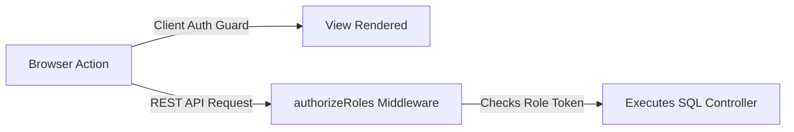

# JSW MCMS Role-Based Access Control (RBAC) Spec

This document details the security matrix, access patterns, endpoint guards, and client-side view filters designed to enforce strict **Role-Based Access Control (RBAC)** across the JSW Metal Cost Management System (MCMS).

---

## 👥 Core Role Definitions

The system segregates operational capabilities into four dedicated functional roles:

1. **Admin (`ADMIN`)**:
   - **Scope**: Total unrestricted clearance.
   - **Primary Duty**: Configures users, monitors audit logs, modifies system settings, reviews alerts, and overrides prices in emergencies.
2. **Procurement Specialist (`PROCUREMENT`)**:
   - **Scope**: Supply chain and price management.
   - **Primary Duty**: Updates metal prices, creates suppliers, configures raw material listings, and monitors price histories.
3. **Finance Controller (`FINANCE`)**:
   - **Scope**: Auditing, formula validation, and tax mapping.
   - **Primary Duty**: Configures GST slabs, reviews locked costing calculations, and exports historical audit sheets for compliance reports.
4. **Production Engineer (`PRODUCTION`)**:
   - **Scope**: Costing worksheets and alloy builder calculations.
   - **Primary Duty**: Builds calculations (drafting, previewing, and completing), manages custom alloy definitions, and conducts grade comparisons.

---

## 📊 RBAC Permissions Matrix

| Operations / Modules | Admin | Procurement | Finance | Production |
| :--- | :---: | :---: | :---: | :---: |
| **User CRUD** (`/api/users`) | **✓** | ✗ | ✗ | ✗ |
| **Audit Logs** (`/api/audit-logs`) | **✓** | ✗ | ✗ | ✗ |
| **System Settings** (`/api/settings`) | **✓** | ✗ | **✓** | ✗ |
| **Gst Slabs Management** (`/api/gst-slabs`) | **✓** | ✗ | **✓** | ✗ |
| **Manage Master Tables** (`/api/metals`, etc.) | **✓** | **✓** | ✗ | ✗ |
| **Update Metal Prices** (`/api/prices`) | **✓** | **✓** | ✗ | ✗ |
| **Create Calculations** (`POST /api/calculations`) | **✓** | ✗ | ✗ | **✓** |
| **Complete Calculations** (`POST /api/calculations/complete`) | **✓** | ✗ | ✗ | **✓** |
| **Alloy Builders CRUD** (`/api/alloys`) | **✓** | ✗ | ✗ | **✓** |
| **Grade Comparisons** (`/api/comparisons`) | **✓** | ✗ | **✓** | **✓** |
| **Price History View** (`/api/price-history`) | **✓** | **✓** | **✓** | **✓** |
| **Real-time SSE Streams** (`/api/notifications/stream`) | **✓** | **✓** | **✓** | **✓** |

*Legend: **✓** = Full Write/Read Access | ✗ = Access Denied (Blocks process with HTTP 403 Forbidden).*

---

## 🔒 Security Enforcements

Security is implemented at both architectural boundaries:



### 1. Authoritative Backend Endpoint Guard

Endpoints check authorization claims using the JWT payload via the `authorizeRoles` Express middleware:

```typescript
// apps/backend/src/middleware/auth.ts
export const authorizeRoles = (...allowedRoles: string[]) => {
  return (req: Request, res: Response, next: NextFunction) => {
    const userRole = req.user?.role; // Parsed from authenticated JWT payload
    
    if (!userRole || !allowedRoles.includes(userRole)) {
      return res.status(403).json({
        success: false,
        error: "Forbidden: You do not have sufficient clearance to access this module.",
        timestamp: new Date().toISOString()
      });
    }
    
    next();
  };
};
```

**Implementation Example:**
```typescript
// apps/backend/src/routes/users.ts
router.post('/', authenticateJWT, authorizeRoles('ADMIN'), userController.createUser);
```

### 2. Frontend User Experience Ergonomics

The frontend React client implements custom route guards and navigation layouts:
- **Route Guards (`src/routes/ProtectedRoute.tsx`)**: Intercepts unauthenticated sessions and redirects them to the login screen, while routing users without the correct role to a custom `403 Access Denied` error page.
- **Dynamic Sidebars (`src/layouts/AdminLayout.tsx`)**: Evaluates the Zustand auth store (`useAuthStore`) to show menu items corresponding to the user's role:
  - If role is `PRODUCTION`, master table setup links are hidden from view.
  - If role is `PROCUREMENT`, costing workspace links are hidden from view.
